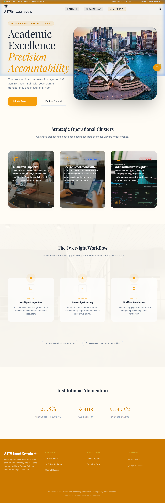

# 🏫 ASTU Smart Complaint & Issue Tracking System
### A Premium AI-First Campus Management Ecosystem

---

## 🌟 Overview
**ASTU Smart Complaint** is a world-class institutional platform designed to streamline campus workflows, enhance accountability, and provide students with a sophisticated AI-driven support system. Built on an advanced **Retrieval-Augmented Generation (RAG)** pipeline, it bridges the gap between complex university regulations and everyday student needs.

*Figure 1: The ASTU Smart Complaint Hero Dashboard - Featuring Cinematic Depth and Glassmorphism.*

---

## 🏗️ Technical Architecture
The system is built with a high-performance modular architecture ensuring scalability and security.

- **Frontend**: React 19, Vite, Framer Motion, Lucide Icons.
- **Backend**: Express.js (ESM), MongoDB (Vector Storage + Structured Data).
- **AI Stack**: Gemini Pro, Text-Embedding-004, MongoDB Atlas Vector Search.
- **Security**: JWT Authentication, Role-Based Access Control (RBAC).

## 🧠 The AI Intelligence Engine (RAG)
Unlike standard support bots, our system is grounded in institutional truth:
1. **Ingestion**: Admin uploads campus policies and IT guides.
2. **Vectorization**: Data is embedded using Google's `text-embedding-004`.
3. **Semantic Retrieval**: Relevant context is fetched from MongoDB Atlas.
4. **Contextual Generation**: Gemini Pro synthesizes reliable, hallucination-free responses.

## 🚀 Key Modules
- **Campus AI Assistant**: 24/7 support for dormitory rules, IT troubleshooting, and policy guidance.
- **Structured Ticket Lifecycle**: Complete tracking from `Open` → `In Progress` → `Resolved`.
- **Institutional Analytics**: Real-time heatmaps and trend analysis for administrative oversight.
- **Campus Map Integration**: Interactive visualization of reported issues across campus locations.

---

## 🛠️ Installation & Setup

### Prerequisites
- Node.js (v18+)
- MongoDB Atlas Account
- Google Gemini API Key

### Backend Setup
1. `cd backend`
2. `npm install`
3. Create a `.env` file with your credentials.
4. `npm run dev`

### Frontend Setup
1. `cd frontend`
2. `npm install`
3. `npm run dev`

---
*© 2026 Adama Science and Technology University. Developed by Reiko Wakbeka.*
